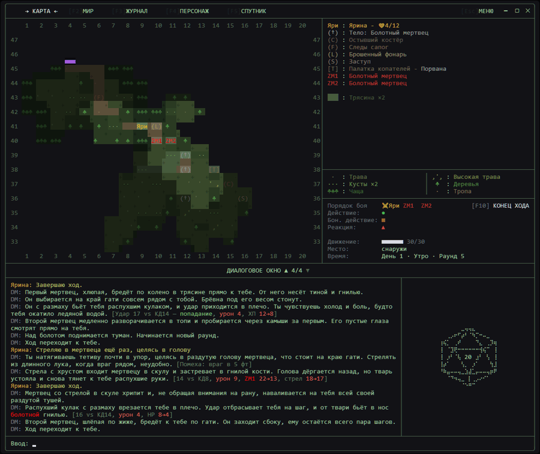
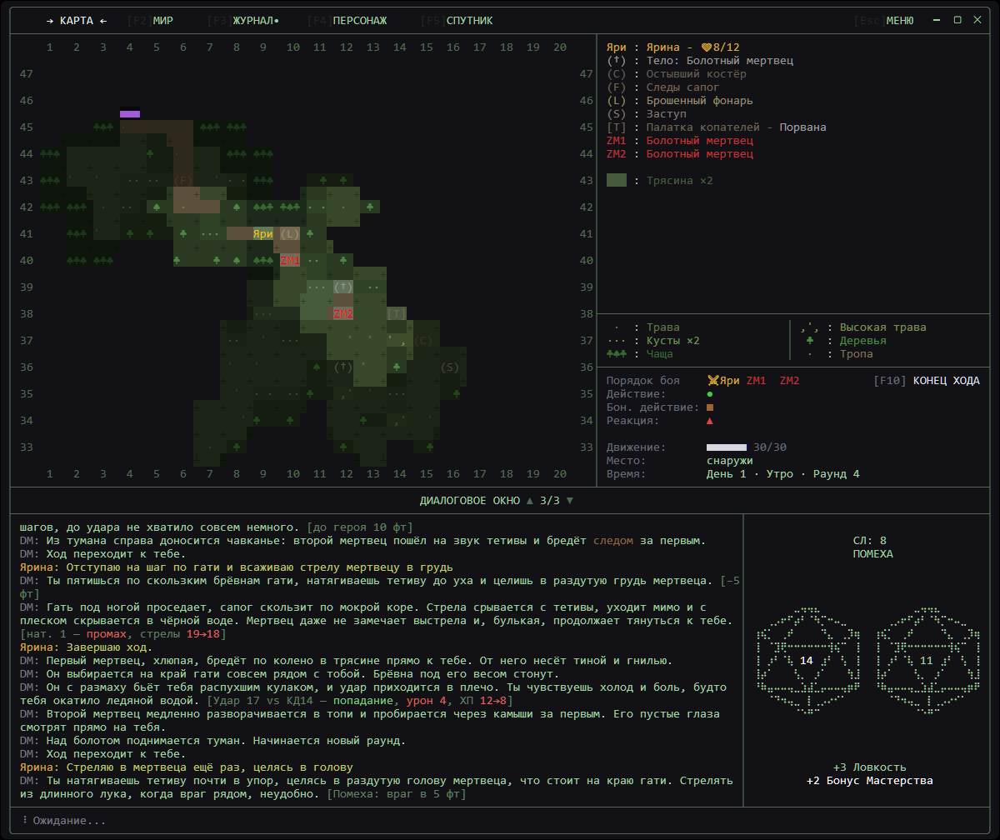
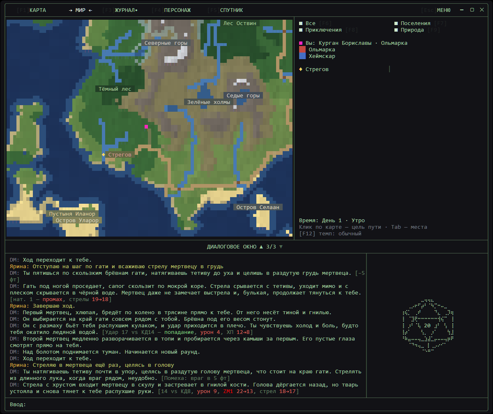

# 🐉 NaviDnD

[Русский](README.md) · **English**

**A tabletop RPG where the Dungeon Master is an AI.**
Create a hero, explore the world and fight on a tactical map. The DM runs the story, plays the characters and keeps the D&D 5e rules.

### [⬇️ Download the latest version](https://gitlab.com/navitalevich/navi-dnd/-/releases/permalink/latest)

[All releases](https://gitlab.com/navitalevich/navi-dnd/-/releases) · Windows x64

| Fair roll with disadvantage | World map |
| --- | --- |
|  |  |

*Screenshots are from a Russian playthrough; the game is fully playable in English too.*

---

## ✨ Features

- 🎲 **AI Dungeon Master** — Claude or OpenAI Codex runs the game by the D&D 5e rules
- 🗺️ **Tactical and world maps** — grid combat and travel between locations
- 📜 **Journal and character sheet** — everything about your hero and adventure at hand
- 🌐 **English or Russian** — interface, story and generated names; choose in Settings
- 🔊 **Voice-over** — the narrator reads lines aloud, offline
- 🔄 **Auto-updates** — the game downloads only changed files

## 🚀 Getting started

1. Download the installer from the link above and run it.
2. Sign in to [Claude Code](https://code.claude.com/docs/en/quickstart) or [Codex CLI](https://developers.openai.com/codex/cli) — the game finds them itself.
3. In **Settings**, set **LANGUAGE** to **ENGLISH**, then choose **New game** and create a character.

---

For developers: [build, tests and releases](docs/development.md) (in Russian).

**License:** free for non-commercial use with attribution. Selling or commercial use only with the author's written permission. Details — [LICENSE](LICENSE).
